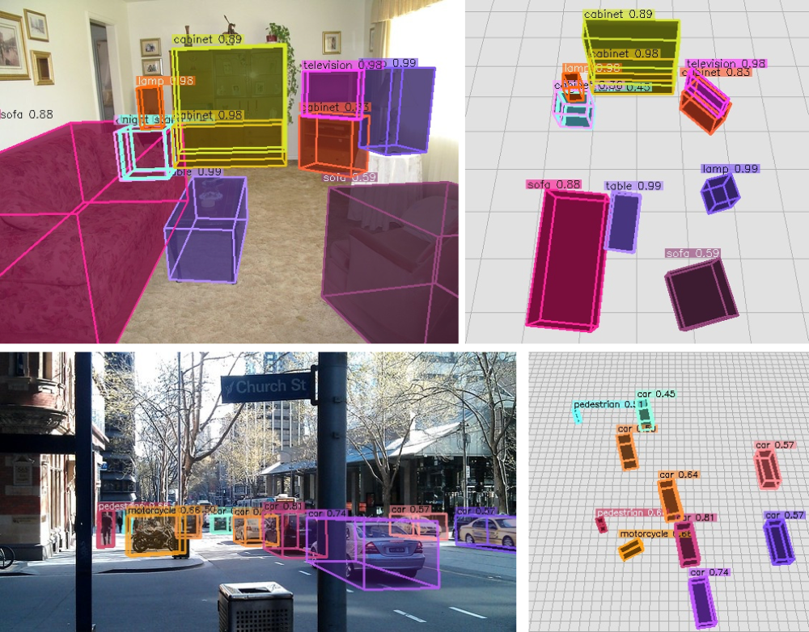

# Omni3D & Cube R-CNN

[](https://opensource.fb.com/support-ukraine)

**Omni3D: A Large Benchmark and Model for 3D Object Detection in the Wild**

[Garrick Brazil][gb], [Julian Straub][js], [Nikhila Ravi][nr], [Justin Johnson][jj], [Georgia Gkioxari][gg]

[[`Project Page`](https://garrickbrazil.com/omni3d)] [[`arXiv`](https://arxiv.org/abs/2207.10660)] [[`BibTeX`](#citing)]


<table style="border-collapse: collapse; border: none;">
<tr>
	<td width="60%">
		<p align="center">
			Zero-shot (+ tracking) on <a href="https://about.facebook.com/realitylabs/projectaria">Project Aria</a> data
			
		</p>
	</td>
	<td width="40%">
		<p align="center">
			Predictions on COCO
			
		</p>
	</td>
</tr>
</table>

<!--
## Cube R-CNN Overview
<p align="center">

</p>
-->

## Table of Contents:
1. [Installation](#installation)
2. [Demo](#demo)
3. [Omni3D Data](#data)
4. [Cube R-CNN Training](#training)
5. [Cube R-CNN Inference](#inference)
6. [Results](#results)
7. [License](#license)
8. [Citing](#citing)


## Installation <a name="installation"></a>

- [Detectron2][d2]
- [PyTorch][pyt]
- [PyTorch3D][py3d]
- [COCO][coco]

``` bash
# setup new evironment
conda create -n cubercnn python=3.8
source activate cubercnn

# main dependencies
conda install -c fvcore -c iopath -c conda-forge -c pytorch3d-nightly -c pytorch fvcore iopath pytorch3d pytorch=1.8 torchvision cudatoolkit=10.1

# OpenCV, COCO, detectron2
pip install cython opencv-python
pip install 'git+https://github.com/cocodataset/cocoapi.git#subdirectory=PythonAPI'
python -m pip install detectron2 -f https://dl.fbaipublicfiles.com/detectron2/wheels/cu101/torch1.8/index.html

# other dependencies
conda install -c conda-forge scipy seaborn
```

For reference, we used `cuda/10.1` and `cudnn/v7.6.5.32` for our experiments. We expect that slight variations in versions are also compatible. 

## Demo <a name="demo"></a>

To run the Cube R-CNN demo on a folder of input images using our `DLA34` model trained on the full Omni3D dataset,

``` bash
# Download example COCO images
sh demo/download_demo_COCO_images.sh

# Run an example demo
python demo/demo.py \
--config-file cubercnn://omni3d/cubercnn_DLA34_FPN.yaml \
--input-folder "datasets/coco_examples" \
--threshold 0.25 --display \
MODEL.WEIGHTS cubercnn://omni3d/cubercnn_DLA34_FPN.pth \
OUTPUT_DIR output/demo 
```

See [`demo.py`](demo/demo.py) for more details. See our [`MODEL_ZOO.md`](MODEL_ZOO.md) for more model checkpoints. 

## Omni3D Data <a name="data"></a>
See [`DATA.md`](DATA.md) for instructions on how to download and set up images and annotations of our Omni3D benchmark for training and evaluating Cube R-CNN. 

## Training Cube R-CNN on Omni3D <a name="training"></a>

We provide config files for trainin Cube R-CNN on
* Omni3D: [`configs/Base_Omni3D.yaml`](configs/Base_Omni3D.yaml)
* Omni3D indoor: [`configs/Base_Omni3D_in.yaml`](configs/Base_Omni3D_in.yaml)
* Omni3D outdoor: [`configs/Base_Omni3D_out.yaml`](configs/Base_Omni3D_out.yaml)

We train on 48 GPUs using [submitit](https://github.com/facebookincubator/submitit) which wraps the following training command,
```bash
python tools/train_net.py \
  --config-file configs/Base_Omni3D.yaml \
  OUTPUT_DIR output/omni3d_example_run
```

Note that our provided configs specify hyperparameters tuned for 48 GPUs. You could train on 1 GPU (though with no guarantee of reaching the final performance) as follows,
``` bash
python tools/train_net.py \
  --config-file configs/Base_Omni3D.yaml --num-gpus 1 \
  SOLVER.IMS_PER_BATCH 4 SOLVER.BASE_LR 0.000625 \
  SOLVER.MAX_ITER 5568000 SOLVER.STEPS (3340800, 4454400) \
  SOLVER.WARMUP_ITERS 174000 TEST.EVAL_PERIOD 1392000 \
  VIS_PERIOD 111360 OUTPUT_DIR output/omni3d_example_run
```

### Tips for Tuning Hyperparameters <a name="tuning"></a>

Our Omni3D configs are designed for multi-node training. 

We follow a simple scaling rule for adjusting to different system configurations. We find that 16GB GPUs (e.g. V100s) can hold 4 images per batch when training with a `DLA34` backbone. If $g$ is the number of GPUs, then the number of images per batch is $b = 4g$. Let's define $r$ to be the ratio between the recommended batch size $b_0$ and the actual batch size $b$, namely $r = b_0 / b$. The values for $b_0$ can be found in the configs. For instance, for the full Omni3D training $b_0 = 196$ as shown [here](https://github.com/facebookresearch/omni3d/blob/main/configs/Base_Omni3D.yaml#L4).
We scale the following hyperparameters as follows:

  * `SOLVER.IMS_PER_BATCH` $=b$
  * `SOLVER.BASE_LR` $/=r$
  * `SOLVER.MAX_ITER`  $*=r$
  * `SOLVER.STEPS`  $*=r$
  * `SOLVER.WARMUP_ITERS` $*=r$
  * `TEST.EVAL_PERIOD` $*=r$
  * `VIS_PERIOD`  $*=r$

We tune the number of GPUs $g$ such that `SOLVER.MAX_ITER` is in a range between about 90 - 120k iterations. We cannot guarantee that all GPU configurations perform the same. We expect noticeable performance differences at extreme ends of resources (e.g. when using 1 GPU).

## Inference on Omni3D <a name="inference"></a>

To evaluate trained models from Cube R-CNN's [`MODEL_ZOO.md`](MODEL_ZOO.md), run

```
python tools/train_net.py \
  --eval-only --config-file cubercnn://omni3d/cubercnn_DLA34_FPN.yaml \
  MODEL.WEIGHTS cubercnn://omni3d/cubercnn_DLA34_FPN.pth \
  OUTPUT_DIR output/evaluation
```

Our evaluation is similar to COCO evaluation and uses $IoU_{3D}$ (from [PyTorch3D](https://github.com/facebookresearch/pytorch3d/blob/main/pytorch3d/ops/iou_box3d.py)) as a metric. We compute the aggregate 3D performance averaged across categories. 

[Coming Soon!] An example script for evaluating any model independent from Cube R-CNN's testing loop is coming soon!

## Results <a name="results"></a>

See [`RESULTS.md`](RESULTS.md) for detailed Cube R-CNN performance and comparison with other methods.

## License <a name="license"></a>
Cube R-CNN is released under [CC-BY-NC 4.0](LICENSE.md).

## Citing <a name="citing"></a>

Please use the following BibTeX entry if you use Omni3D and/or Cube R-CNN in your research or refer to our results.

```BibTeX
@article{brazil2022omni3d,
  author =       {Garrick Brazil and Julian Straub and Nikhila Ravi and Justin Johnson and Georgia Gkioxari},
  title =        {{Omni3D}: A Large Benchmark and Model for {3D} Object Detection in the Wild},
  journal =      {arXiv:2207.10660},
  year =         {2022}
}
```

If you use the Omni3D benchmark, we kindly ask you to additionally cite all datasets. BibTex entries are provided below.

<details><summary>Dataset BibTex</summary>

```BibTex
@inproceedings{Geiger2012CVPR,
  author = {Andreas Geiger and Philip Lenz and Raquel Urtasun},
  title = {Are we ready for Autonomous Driving? The KITTI Vision Benchmark Suite},
  booktitle = {CVPR},
  year = {2012}
}
``` 

```BibTex
@inproceedings{caesar2020nuscenes,
  title={nuscenes: A multimodal dataset for autonomous driving},
  author={Caesar, Holger and Bankiti, Varun and Lang, Alex H and Vora, Sourabh and Liong, Venice Erin and Xu, Qiang and Krishnan, Anush and Pan, Yu and Baldan, Giancarlo and Beijbom, Oscar},
  booktitle={CVPR},
  year={2020}
}
```

```BibTex
@inproceedings{song2015sun,
  title={Sun rgb-d: A rgb-d scene understanding benchmark suite},
  author={Song, Shuran and Lichtenberg, Samuel P and Xiao, Jianxiong},
  booktitle={CVPR},
  year={2015}
}
```

```BibTex
@inproceedings{dehghan2021arkitscenes,
  title={{ARK}itScenes - A Diverse Real-World Dataset for 3D Indoor Scene Understanding Using Mobile {RGB}-D Data},
  author={Gilad Baruch and Zhuoyuan Chen and Afshin Dehghan and Tal Dimry and Yuri Feigin and Peter Fu and Thomas Gebauer and Brandon Joffe and Daniel Kurz and Arik Schwartz and Elad Shulman},
  booktitle={NeurIPS Datasets and Benchmarks Track (Round 1)},
  year={2021},
}
```

```BibTex
@inproceedings{hypersim,
  author    = {Mike Roberts AND Jason Ramapuram AND Anurag Ranjan AND Atulit Kumar AND
                 Miguel Angel Bautista AND Nathan Paczan AND Russ Webb AND Joshua M. Susskind},
  title     = {{Hypersim}: {A} Photorealistic Synthetic Dataset for Holistic Indoor Scene Understanding},
  booktitle = {ICCV},
  year      = {2021},
}
```

```BibTex
@article{objectron2021,
  title={Objectron: A Large Scale Dataset of Object-Centric Videos in the Wild with Pose Annotations},
  author={Ahmadyan, Adel and Zhang, Liangkai and Ablavatski, Artsiom and Wei, Jianing and Grundmann, Matthias},
  journal={CVPR},
  year={2021},
}
```

</details>

[gg]: https://github.com/gkioxari
[jj]: https://github.com/jcjohnson
[gb]: https://github.com/garrickbrazil
[nr]: https://github.com/nikhilaravi
[js]: https://github.com/jstraub
[d2]: https://github.com/facebookresearch/detectron2
[py3d]: https://github.com/facebookresearch/pytorch3d
[pyt]: https://pytorch.org/
[coco]: https://cocodataset.org/


# Instruction to train Omni3d

## Data Preparation

0) Change the paths in ```configs/paths.py```, and set the ```Weigths & Biases``` account.

1) First run the following command to pre-process the Intercap dataset (some lines are commented out because they cannot be run without ```sudo```):

```
python pre_process_intercap.py
```

2) After you have pre-processed Intercap and Behave you can start preparing the datasets for Omni3D (Remember to change the dataset mode at line ```48``` in ```dataset/base_options.py```, you can choose between ```behave_img``` and ```intercap_img```):

```
python omni3d_behave_preparation.py
```

```
python omni3d_intercap_preparation.py
```

3) To Create a small test dataset for both datasets you should comment line ```134``` and uncomment line ```135``` in ```omni3d_behave_preparation.py```, and then reduce the dataset dimension by commeting line ```55``` and uncommenting line ```54``` in ```dataset/base_options.py```. Then do the same for line ```139``` and ```140``` in ```omni3d_intercap_preparation.py```

4) You can visualize if the data preparation is going well by uncommeting lines ```86```,```89```,```91```,```92```. It will log the images on ```Weigths & Biases```.

## Training 

1) There are a lot of config files where the category names are repeated: 
  - ```configs/Base_Behave.yaml```
  -  ```cubercnn/data/builtin.py```
  - ```configs/category_meta.json``` 
  - ```omni3d_behave_preparation.py``` (line 119) 
  - ```omni3d_intercap_preparation.py``` (line 119) 
  
    So everytime you change or add a category name make sure to change it in every file.

2) To start the training run the following command:

```
python tools/train_net.py --config-file configs/Base_Behave.yaml
```

3) On the config file ```Base_Behave.yaml``` you can set the ```Train``` and ```Test ```dataset, the ```category names``` and ```category number```.

4) The predictions on the Test set will be logged on ```Weights & Biases``` during the training.


## Evaluation

1) First You need to generate the ```Json file``` with the GT bboxes and GT human vertices, you can do this by running (you need to change the path at line ```37```):

```
python generate_json.py
```

    Note that this file is only for ```Behave``` and should be modified for the ```Intercap``` dataset.

2) Genrate the full test dataset for both ```Behave``` and ```Intercap``` by running step ```2)``` of ```Data Preparation``` but without commeting line ```55``` and uncommenting line ```54```.

3) Then you need to generate the Json file with the predicted bboxes for both Behave and Intercap (You need to change the path at lines ```37```, ```68```, ```72```, ```189```, and also in the python command):

```
python generate_bbox_person.py --config-file configs/Base_Behave.yaml --input-folder="PATH TO THE DATASET" --threshold 0.25 MODEL.WEIGHTS checkpoint/YOUR_CHECKPOINT OUTPUT_DIR YOUR_OUTPUT_FOLDER
```

4) Finally you can evaluate the Omni3d model by running

```
python evaluation_script_person.py
```

    Note that you need to change the paths at line ```670```, ```671```, ```672``` (You will to put the Json files previously generated in step 2). 

    And you also need to comment and uncomment some ```function calls```, based on what you want to evaluate. 

5) Function to evaluate the model in ```evaluation_script_person.py``` 
- ```calc_errors_on_high_prob_bbox``` : Calculate the error using the high probability bboxes.
- ```calc_errors_using_closest_bbox``` : Calculate the error choosing the best bbox based on the distance from the GT bbox.
- ```calc_errors_on_closest_bbox_human``` : Calculate the error choosing the best bbox based on the confidence and also the distance from the person.
- ```save_pdf_visualisation``` : Save in a PDF the visalizations of the predicted bboxex.
- ```calc_chamfer_on_different_iou``` : Calculate the chamfer distance dividing the images based on the IOU of the object (IOU>0.3 and IOU<0.3). The input is a json file path with the chamfer distance for each image.
- ```calc_iou_on_3d_bbox``` : Calculate the 3d IOU between the GT and predicted 3D bounding boxes.
- ```calc_iou_on_3d_bbox_by_class``` : Calculate the 3d IOU between the GT and predicted 3D bounding boxes, dividing the results by object catogories.
- ```calc_errors_on_closest_bbox_human_by_class_relative``` : Calculate the relative error (based on the object length) choosing the best bbox based on the confidence and also the distance from the person. It divide the result by object categories.
- ```calc_errors_on_closest_bbox_human_by_class_absolute``` : Calculate the absolute error choosing the best bbox based on the confidence and also the distance from the person. It divide the result by object categories.
- ```calc_num_wrong_bbox``` : Calculate number of high probability bboxes that are not inside the GT bbox.
